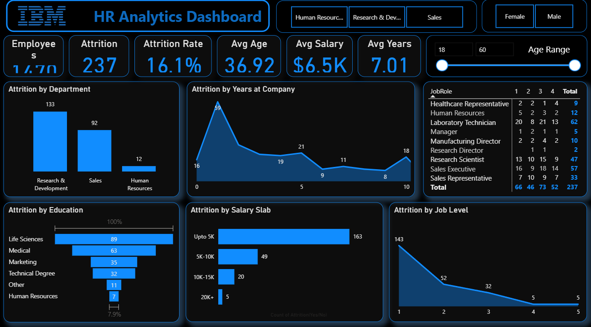
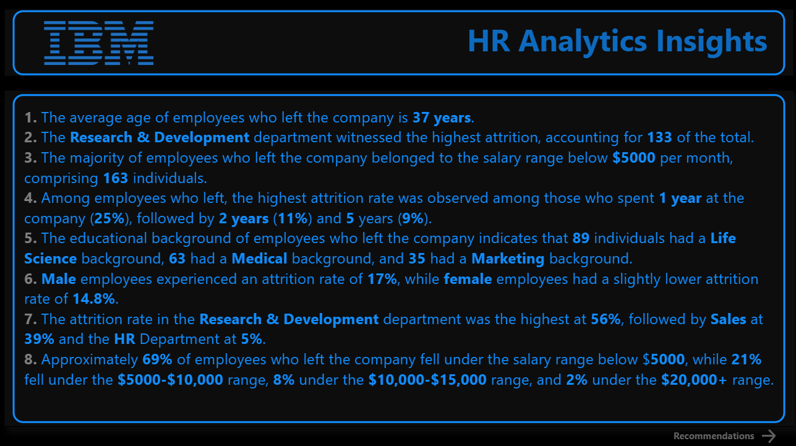
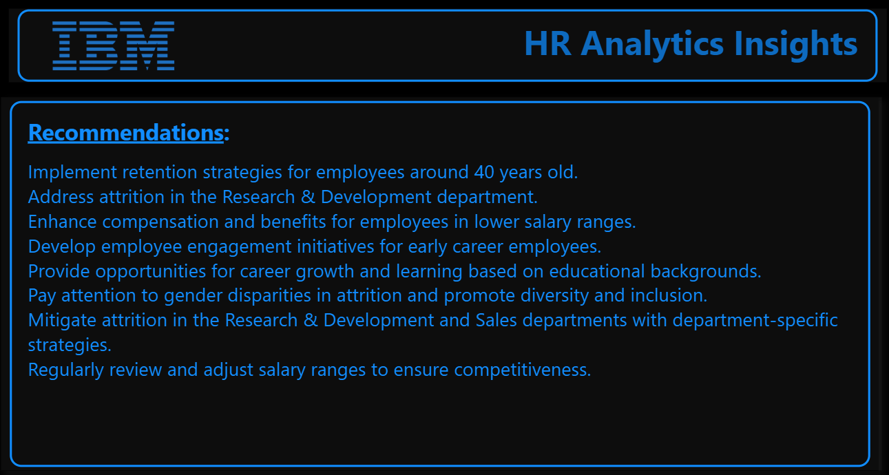

# 🧑‍💼 IBM HR Analytics — Employee Attrition Intelligence Platform

> _"You can't fix what you don't measure. And you can't retain who you don't understand."_

[](https://www.python.org/)
[](https://powerbi.microsoft.com/)
[](https://pandas.pydata.org/)
[](https://scikit-learn.org/)
[](https://microsoft.com/excel)
[]()
[]()

---

## 🚀 TL;DR

**A full-stack People Analytics project** that goes beyond dashboards — this is a workforce intelligence system that identifies *who* is leaving, *why* they leave, and *what it costs* the business.

- 📊 Analyzed **1,470 employees** across **35 HR variables**
- 💸 Quantified **$6.8M – $27.2M** in estimated annual attrition cost
- 🔍 Uncovered **10 statistically-backed attrition drivers**
- 🎯 Delivered **actionable retention strategies** tied to each finding
- 👶 Discovered that **employees aged 18–24 leave at 39.2%** — the most at-risk group in the entire workforce

> HR teams don't need more data. They need the *right* story from the data — **this project tells that story.**

---

## 💸 The Business Case — Why This Matters

| Metric | Value |
|---|---|
| Employees Who Left | **237 out of 1,470** |
| Overall Attrition Rate | **16.1%** |
| Avg Monthly Salary of Leavers | **$4,787** |
| Avg Annual Salary of Leavers | **$57,444** |
| Replacement Cost Per Employee | **$28,722 – $114,888** |
| 🔴 **Total Annual Attrition Cost** | **$6.8M – $27.2M** |

> Replacing one employee costs **50–200% of their annual salary** in recruiting, onboarding, lost productivity, and knowledge drain. This isn't an HR problem — **this is a P&L problem.**

---

## 🖥️ Dashboard Preview

> **Interactive Power BI dashboard** with department, gender, age range & job role filters — built for HR teams to explore attrition patterns at a glance.



### 📌 What the Dashboard Shows
- **KPI Cards** — Total employees, attrition count, attrition rate, avg age, avg salary, avg tenure
- **Attrition by Department** — R&D leads with 133, Sales at 92, HR at 12
- **Attrition by Years at Company** — Peak exodus at Year 1 (59 employees)
- **Attrition by Salary Slab** — 163 of 237 leavers earned under $5K/month
- **Attrition by Job Level** — Level 1 most vulnerable with 143 departures
- **Job Role Satisfaction Matrix** — Cross-tab of satisfaction scores vs attrition by role
- **Interactive Filters** — Department, Gender, Age Range sliders

---

## 📋 Key Insights



### 8 Data-Backed Findings from the Analysis

| # | Insight | Key Metric |
|---|---|---|
| 1 | Average age of employees who left | **37 years** |
| 2 | Highest attrition department | **R&D — 133 employees (56% of total)** |
| 3 | Majority of leavers by salary | **163 earned below $5,000/month (69%)** |
| 4 | Highest attrition tenure | **Year 1 — 25% of leavers** |
| 5 | Top education background of leavers | **Life Sciences — 89 employees** |
| 6 | Gender attrition gap | **Male 17% vs Female 14.8%** |
| 7 | Department share of total attrition | **R&D 56% → Sales 39% → HR 5%** |
| 8 | Salary breakdown of leavers | **69% under $5K → 21% $5K–10K → 8% $10K–15K** |

---

## 💡 Strategic Recommendations



### 8 Actionable HR Interventions

**1️⃣ Retention strategies for employees around 40 years old**
> Mid-career employees are a flight risk — career acceleration programs and leadership tracks help retain this experience-rich segment.

**2️⃣ Address attrition in Research & Development**
> R&D drives 56% of total attrition despite being the largest department. Role clarity, project ownership, and innovation incentives are critical here.

**3️⃣ Enhance compensation for employees in lower salary ranges**
> 69% of leavers earned under $5K/month. Even a $500–$1,000/month salary adjustment delivers far better ROI than a $28K–$114K replacement cost.

**4️⃣ Develop employee engagement initiatives for early career employees**
> Year 1 attrition is the highest at 25%. Structured onboarding, 30-60-90 day check-ins, and buddy systems directly reduce first-year turnover.

**5️⃣ Provide career growth opportunities based on educational background**
> Life Sciences (89) and Medical (63) graduates dominate attrition — align L&D programs to their field-specific growth aspirations.

**6️⃣ Address gender disparities and promote diversity & inclusion**
> Male attrition (17%) vs Female (14.8%) — while the gap is smaller than expected, targeted D&I initiatives improve culture scores across both groups.

**7️⃣ Implement department-specific retention strategies for R&D and Sales**
> One-size-fits-all retention doesn't work. R&D needs autonomy and innovation culture; Sales needs commission clarity and career ladder visibility.

**8️⃣ Regularly review and adjust salary ranges for market competitiveness**
> Annual compensation benchmarking vs market rates is the single highest-ROI HR activity for reducing voluntary attrition.

---

## 📊 The 10 Attrition Drivers — Deep Dive

### 🔴 CRITICAL RISK

| Driver | Segment | Attrition Rate |
|---|---|---|
| Age | 18–24 year olds | 🔴 **39.2%** |
| Job Role | Sales Representatives | 🔴 **39.8%** |
| Overtime | Overtime workers | 🔴 **30.5%** |
| Salary | Under $5K/month | 🔴 **69% of all leavers** |

### 🟡 HIGH RISK

| Driver | Segment | Attrition Rate |
|---|---|---|
| Stock Options | No stock options | 🟡 **24.4%** |
| Marital Status | Single employees | 🟡 **25.5%** |
| Environment Satisfaction | Level 1 (lowest) | 🟡 **25.4%** |
| Business Travel | Frequent travelers | 🟡 **24.9%** |
| Work-Life Balance | Level 1 (worst) | 🟡 **31.2%** |

### 🟢 POSITIVE SIGNALS

| Driver | Segment | Attrition Rate |
|---|---|---|
| Job Satisfaction | Level 4 (highest) | 🟢 **11.3%** |
| Stock Options | Level 2 | 🟢 **7.6%** |
| Job Level | Level 5 (senior) | 🟢 **Very Low** |

---

## 🗂 Folder Structure

```
IBM-HR-Attrition-Analytics/
│
├─ 📊 IBM_HR-Analytics_Dashboard.pbix     # Interactive Power BI dashboard
├─ 🐍 attrition_analysis.py               # Full Python EDA & statistical analysis
├─ 📄 dataset.csv                         # IBM HR Analytics dataset (1,470 records)
├─ 📁 Graphs/
│   ├─ Dashboard.png                      # Main dashboard screenshot
│   ├─ Insights.png                       # Key insights page
│   └─ Recommendation.png                # Recommendations page
├─ 📋 requirements.txt                    # Python dependencies
└─ 📝 README.md                           # This file
```

---

## 🧠 Full Analysis Workflow

```
RAW DATA (1,470 records · 35 variables)
        ↓
DATA CLEANING & VALIDATION
  • Handled data types, nulls, categorical encoding
  • Validated all 35 variables for consistency
        ↓
EXPLORATORY DATA ANALYSIS (Python / Pandas)
  • Attrition rates across all demographic & job variables
  • Statistical cross-tabulation of 10 key drivers
  • Compensation gap & cost quantification
        ↓
POWER BI DASHBOARD (3 Pages)
  • Page 1: Main Dashboard — KPIs, dept, salary, job level
  • Page 2: HR Analytics Insights — 8 key findings
  • Page 3: Recommendations — 8 strategic HR actions
        ↓
HR STRATEGY TRANSLATION
  • Each finding → Concrete retention recommendation
  • Each recommendation → Estimated dollar ROI
```

---

## 🚀 Quickstart

```bash
# Clone repository
git clone https://github.com/shashikathi/IBM-HR-Attrition-Analytics.git
cd IBM-HR-Attrition-Analytics

# Install dependencies
pip install -r requirements.txt

# Run full EDA analysis
python attrition_analysis.py
```

*(To explore the interactive dashboard)*
```
1. Download Power BI Desktop — free at powerbi.microsoft.com
2. Open IBM_HR-Analytics_Dashboard.pbix
3. Use Department, Gender & Age Range slicers to explore segments
4. Navigate: Dashboard → Insights → Recommendations
```

---

## 🧩 Tech Stack

| Category | Tools |
|---|---|
| Data Analysis & EDA | Python, Pandas, NumPy |
| Statistical Analysis | Cross-tabulation, Segmentation, Correlation |
| Visualization | Power BI, Matplotlib, Seaborn |
| Spreadsheet Reporting | Microsoft Excel |
| Environment | Jupyter Notebook, VS Code |

---

## 📊 Dataset

**IBM HR Analytics Employee Attrition & Performance**
- 📁 **1,470 employee records**
- 📋 **35 variables** — salary, satisfaction, tenure, travel frequency, overtime, stock options, marital status, department, job role & more
- 🔗 Source: [Kaggle — IBM HR Analytics Dataset](https://www.kaggle.com/datasets/pavansubhasht/ibm-hr-analytics-attrition-dataset)

> *Fictional dataset created by IBM data scientists for HR analytics education and portfolio development.*

---

## 🌱 Future Enhancements

- 🤖 **Predictive Attrition Model** — XGBoost classifier to flag at-risk employees before they resign
- 📡 **Real-time HRIS Integration** — connect to live HR data for continuous attrition monitoring
- 🧠 **SHAP Explainability** — individual employee risk score breakdowns for managers
- 📧 **Automated Manager Alerts** — trigger check-in workflows for high-risk employee segments
- 🌐 **Streamlit Web App** — self-serve dashboard for HR teams without Power BI access

---

## 👨‍💻 Author

**Kathi Shashi Preetham Goud**
B.Tech CSE | People Analytics | HR Technology | Data Science
📍 Hyderabad, India

🔗 [LinkedIn](https://linkedin.com/in/shashikathi)
🔗 [GitHub](https://github.com/shashikathi)
📧 shashikathi56@gmail.com

---

## 🌟 Show Some ❤️

If this project helped you understand how data can transform HR decision-making, give it a ⭐!

> *The best HR teams in the world don't guess who might leave. They know — because they measure.*
> Let's build that future together. 🚀
